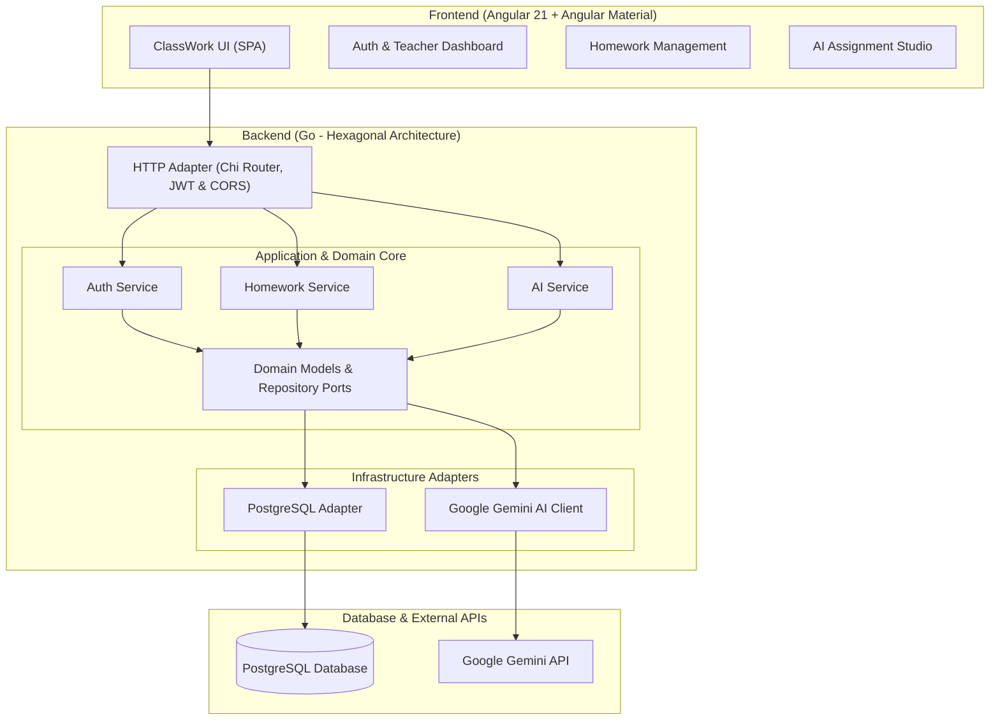

# 📚 ClassWork

[](LICENSE)
[](https://go.dev/)
[](https://angular.dev/)
[](https://www.postgresql.org/)
[](https://ai.google.dev/)
[](backend/pkg/openapi/openapi.yaml)

> **ClassWork** is a modern, open-source classroom and homework management platform. It streamlines assignment creation, tracking, and grading for educators while integrating **Google Gemini AI** to automatically generate comprehensive homework assignments, rubrics, and educational content.

---

## 🌟 Key Features

- 🔐 **Secure Authentication**: JWT-based authentication and role-based access control with bcrypt password hashing.
- 📝 **Homework Management**: Full CRUD operations for creating, organizing, reviewing, and updating classroom assignments.
- 🤖 **AI-Powered Assignment Generator**: Built-in Google Gemini AI integration to generate rich, structured assignments and lesson questions in seconds.
- 🏗️ **Clean Hexagonal Architecture**: Backend designed using Ports and Adapters for maximum testability, maintainability, and domain isolation.
- ⚡ **High Performance REST API**: Built in Go using the Chi router with PostgreSQL persistence.
- 🎨 **Modern Responsive UI**: Interactive frontend built with Angular 21 and Angular Material components.
- 📖 **OpenAPI 3.0 Specification**: Fully documented endpoints with clear request/response schemas.

---

## 🏛️ System Architecture



---

## 📂 Repository Structure

```
classwork/
├── backend/                      # Go Backend (Hexagonal Architecture)
│   ├── config/                   # Configuration loader and environment bindings
│   ├── internal/
│   │   ├── domain/               # Pure business domain entities and repository interfaces
│   │   ├── ports/                # Inbound/outbound port definitions
│   │   ├── application/          # Application orchestration services (Auth, Homework, AI)
│   │   └── adapters/             # Drivers: HTTP handlers, Chi router, PostgreSQL, Gemini AI
│   ├── pkg/openapi/              # OpenAPI 3.0 specification files
│   ├── main.go                   # Application entry point
│   └── go.mod
│
├── frontend/
│   └── classWork-ui/             # Angular 21 Frontend
│       ├── src/
│       │   ├── app/              # Angular components, services, and routing
│       │   └── assets/           # Static assets and styling
│       ├── package.json
│       └── angular.json
│
├── CODE_OF_CONDUCT.md            # Contributor Covenant Code of Conduct
├── CONTRIBUTING.md               # Guidelines for contributing to ClassWork
├── LICENSE                       # MIT License
└── README.md                     # Project documentation
```

---

## 🚀 Getting Started

### 📋 Prerequisites

Ensure you have the following installed on your local machine:

- **Go**: 1.21+ (1.25 recommended)
- **Node.js**: 20+ & **npm**: 10+
- **PostgreSQL**: 12+ (running locally or via Docker)
- **Google Gemini API Key** *(optional, for AI generation features)*

---

### 🗄️ 1. Database Setup

Ensure PostgreSQL is running and create a database:

```sql
CREATE DATABASE classwork_db;
```

---

### ⚙️ 2. Backend Setup

1. Navigate to the backend directory:
   ```bash
   cd backend
   ```

2. Create and configure your environment variables:
   ```bash
   # Copy sample configuration or create .env
   cat <<EOF > .env
   SERVER_PORT=8080
   SERVER_HOST=0.0.0.0
   DB_HOST=localhost
   DB_PORT=5432
   DB_USER=postgres
   DB_PASSWORD=your_postgres_password
   DB_NAME=classwork_db
   DB_SSLMODE=disable
   JWT_SECRET=super-secret-jwt-key
   JWT_EXPIRATION_HOURS=24
   GEMINI_API_KEY=your_gemini_api_key_here
   GEMINI_MODEL=gemini-2.5-flash
   EOF
   ```

3. Download dependencies and run the server:
   ```bash
   go mod download
   go run main.go
   ```

   The server will start at `http://localhost:8080` and auto-initialize the database schema.

---

### 🎨 3. Frontend Setup

1. Open a new terminal and navigate to the frontend directory:
   ```bash
   cd frontend/classWork-ui
   ```

2. Install dependencies:
   ```bash
   npm install
   ```

3. Start the development server:
   ```bash
   npm start
   ```

4. Open `http://localhost:4200` in your web browser.

---

## 📖 API Documentation

ClassWork provides an OpenAPI 3.0 specification located at [`backend/pkg/openapi/openapi.yaml`](backend/pkg/openapi/openapi.yaml).

### Key Endpoints Overview

| Method | Endpoint | Description | Auth Required |
|---|---|---|---|
| `GET` | `/health` | Health check endpoint | ❌ No |
| `POST` | `/api/register` | Register a new teacher account | ❌ No |
| `POST` | `/api/login` | Authenticate teacher & obtain JWT token | ❌ No |
| `GET` | `/api/homework` | List homework assignments | ✅ Bearer Token |
| `POST` | `/api/homework` | Create a new homework assignment | ✅ Bearer Token |
| `GET` | `/api/homework/{id}` | Get homework assignment details | ✅ Bearer Token |
| `PUT` | `/api/homework/{id}` | Update homework assignment | ✅ Bearer Token |
| `DELETE` | `/api/homework/{id}` | Delete homework assignment | ✅ Bearer Token |
| `POST` | `/api/ai/generate-assignment` | Generate homework assignment via Gemini AI | ✅ Bearer Token |

---

## 🧪 Running Tests

### Backend Tests
```bash
cd backend
go test -v ./...
```

### Frontend Tests
```bash
cd frontend/classWork-ui
npm test
```

---

## 🤝 Contributing

We welcome contributions of all kinds! Please read our [CONTRIBUTING.md](CONTRIBUTING.md) guide and adhere to our [CODE_OF_CONDUCT.md](CODE_OF_CONDUCT.md).

1. Fork the Project
2. Create your Feature Branch (`git checkout -b feat/AmazingFeature`)
3. Commit your Changes (`git commit -m 'feat: add some AmazingFeature'`)
4. Push to the Branch (`git push origin feat/AmazingFeature`)
5. Open a Pull Request

---

## 📄 License

This project is licensed under the MIT License - see the [LICENSE](LICENSE) file for details.
