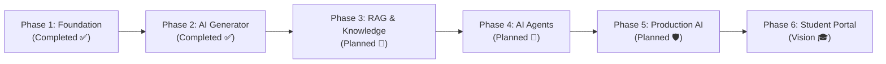

# 🗺️ ClassWork Project Roadmap

Welcome to the **ClassWork** roadmap! This document outlines the strategic vision, architectural milestones, and feature progression of ClassWork from its core foundational services to advanced AI agent orchestration and production deployment.

---

## 🧭 Roadmap Overview

---

## 📌 Detailed Phases

### 🏗️ Phase 1 — Foundation (Completed ✅)
*Establish the core full-stack platform, clean hexagonal architecture, and homework management capabilities.*

- [x] **Authentication & Security**
  - [x] Teacher registration and login with bcrypt password hashing
  - [x] JWT token generation and authentication middleware
  - [x] Role-based access control & CORS configuration
- [x] **Backend Core Architecture**
  - [x] Hexagonal (Ports and Adapters) domain isolation
  - [x] Chi HTTP router migration and structured error handling
  - [x] PostgreSQL persistence adapter with automated schema initialization
  - [x] OpenAPI 3.0 specification & documentation
- [x] **Frontend Foundation**
  - [x] Angular 21 Single Page Application with Angular Material
  - [x] Responsive Teacher Dashboard
  - [x] Homework CRUD (Create, Read, Update, Delete) interfaces
  - [x] Search, filters, and status management

---

### 🤖 Phase 2 — AI Assignment Generator (Completed ✅)
*Empower educators with generative AI to produce high-quality, structured classroom assignments instantly.*

- [x] **LLM Integration**
  - [x] Google Gemini AI Go SDK integration (`@google/genai`)
  - [x] Fallback mechanisms and configuration management (`GEMINI_MODEL`, `GEMINI_API_KEY`)
- [x] **Structured Generation Engine**
  - [x] Strong JSON Schema enforcement for question generation
  - [x] Multi-format question types (Multiple Choice, True/False, Short Answer, Essay)
  - [x] Total marks calculation and point distribution per question
- [x] **Teacher Studio & UI Integration**
  - [x] Dedicated AI Generator Studio component in Angular
  - [x] Customization controls (Topic, Grade Level, Subject, Difficulty, Question Counts)
  - [x] Live preview, editing, and one-click saving to homework database
  - [x] Export options for generated assignments (PDF / Markdown / JSON)

---

### 📚 Phase 3 — RAG & Knowledge Engine (Next Up 🚀)
*Enable teachers to generate curriculum-aligned assignments grounded in their own textbooks, syllabi, and notes.*

- [ ] **Document Ingestion Pipeline**
  - [ ] Multi-format document upload (PDF, DOCX, TXT, Markdown)
  - [ ] Text extraction, semantic chunking, and metadata tagging
- [ ] **Embeddings & Vector Storage**
  - [ ] Integration with embedding models (Gemini Text Embeddings / Vertex AI)
  - [ ] Vector database integration (PostgreSQL `pgvector`, Qdrant, or Pinecone)
  - [ ] Efficient similarity search and hybrid keyword + vector retrieval
- [ ] **Curriculum-Grounded Assignment Generation**
  - [ ] RAG-powered prompt orchestration incorporating uploaded course material
  - [ ] Source citation and textbook chapter references in generated questions
  - [ ] Automated syllabus coverage analysis

---

### 🧠 Phase 4 — Multi-Agent System & Workflows (Planned 🤖)
*Introduce autonomous, collaborative AI agents that assist teachers and students through structured tool-use.*

- [ ] **Tool Calling & Agent Orchestration**
  - [ ] Function calling capabilities for Gemini LLM
  - [ ] Custom tool integrations (Calculator, Code Evaluator, Web Search, Fact Checker)
- [ ] **Specialized Agent Roles**
  - [ ] **Teacher Assistant Agent**: Formulates weekly lesson plans, generates multi-stage rubrics, and creates differentiated assignments.
  - [ ] **Fact-Checker / Reviewer Agent**: Verifies question accuracy, detects ambiguity, and ensures pedagogical soundness before finalizing assignments.
  - [ ] **Student Tutor Agent**: Provides Socratic hints, conceptual explanations, and guided problem-solving without revealing direct answers.
- [ ] **Human-in-the-Loop Workflows**
  - [ ] Interactive approval gates for automated grading and feedback distribution
  - [ ] Teacher override and customized grading criteria

---

### 🛡️ Phase 5 — Production AI, Governance & Observability (Planned ⚙️)
*Harden the platform for enterprise scale, cost efficiency, evaluation benchmarks, and safety.*

- [ ] **AI Observability & Tracing**
  - [ ] OpenTelemetry and LLM tracing (Langfuse / Arize Phoenix)
  - [ ] Latency, token usage, and cost tracking per school/teacher
- [ ] **Evaluation & Quality Assurance**
  - [ ] Automated evaluation datasets (evals) for prompt regression testing
  - [ ] Hallucination detection and accuracy scoring
- [ ] **AI Safety & Guardrails**
  - [ ] Strict content moderation and age-appropriate safety filters
  - [ ] PII redaction and student privacy protection (FERPA / GDPR compliance)
- [ ] **Cloud Infrastructure & Scale**
  - [ ] Containerized microservices deployment (Docker, Kubernetes / Cloud Run)
  - [ ] Redis caching for LLM responses and rate limiting

---

### 🎓 Phase 6 — Student Experience & Interactive Learning (Vision 🔭)
*Expand ClassWork into an end-to-end interactive classroom ecosystem.*

- [ ] **Student Portal & Accounts**
  - [ ] Student login, enrollment codes, and assignment submission portal
  - [ ] Rich text editor and file upload submissions
- [ ] **Automated AI Grading & Feedback**
  - [ ] Rubric-based initial grading suggestions with constructive feedback
  - [ ] Plagiarism and AI-generation detection assistance for teacher review
- [ ] **Gamification & Analytics**
  - [ ] Class performance analytics and difficulty heatmaps
  - [ ] Student progress tracking and mastery badges

---

## 🤝 Contributing to the Roadmap

Have ideas, feature requests, or want to contribute to an upcoming phase? 
- Check out our [Contributing Guide](CONTRIBUTING.md) to get involved.
- Join the conversation on [GitHub Discussions](https://github.com/MrPerfect8699/class-work/discussions) or open an issue!
